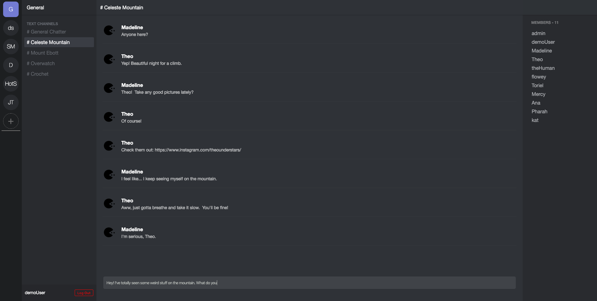

# KatChat

[KatChat Live Demo!](https://kat-chat.herokuapp.com/#/login)

KatChat is a fullstack live messaging application designed after the popular gaming chat-app, Discord. KatChat is built with Ruby on Rails and PostgreSQL on the backend, and React and Redux on the frontend. KatChat gives users the ability to create and join servers, create channels, view server subscribers, and message their friends! For live messaging, this app uses Rails' ActionCables, so that users may receive live messages without the need to refresh on the frontend.




## Technologies Used

- Ruby on Rails for the backend framework.
- PostgreSQL for the database.
- jQuery/ajax used for backend calls.
- Javascript, React and Redux used for front end rendering.
- HTML for website structure.
- CSS/SCSS used for styling

## Noteworthy Features

### ActionCables: Live Messaging

Action cables allow a user to establish a direct connection to the server when entering a chat channel. Users receive up to date information without having to query the database every single time a new message is added to the database.

```JS
    createSocket() {

        let cable = ActionCable.createConsumer();
        this.chats = cable.subscriptions.create({
            channel: 'ChatChannel',
        }, {
            connected: () => {},
            received: (data) => {
                let chatLogs = this.state.chatLogs;
                chatLogs.push(data);
                this.setState({chatLogs: chatLogs})
            },
            create: function(message) {
                this.perform('create', {
                    body: message.body,
                    channel_id: message.channel_id,
                    author_id: message.author_id
                });
            }
        });
    }
```

In order to have access to previous chat messages, as well as live messages without creating two separate components, I combine them. Messages in the component are set up to be an array of objects:

```JS
let allMessages = this.props.messages.concat(this.state.chatLogs);
let message = allMessages.map((message) => {

    let username = null;
    if (users[message.author_id]) {
        username = users[message.author_id].username;
    }
    return (<div className="message-group">
            <div className="user-icon"></div>
            <div className="message-content">
            <span className="username">{username}</span>
                <div className="message-body">
                    {message.body}
                </div>
                </div>
    </div>)
});
```

## Upcoming Features

- Direct Messaging.
- Server editing.
- Channel Editing.
- AWS and better user profiles!
